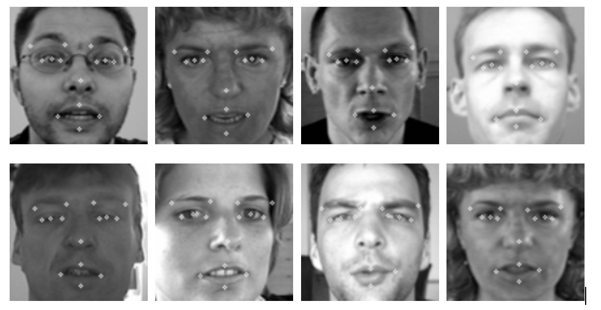
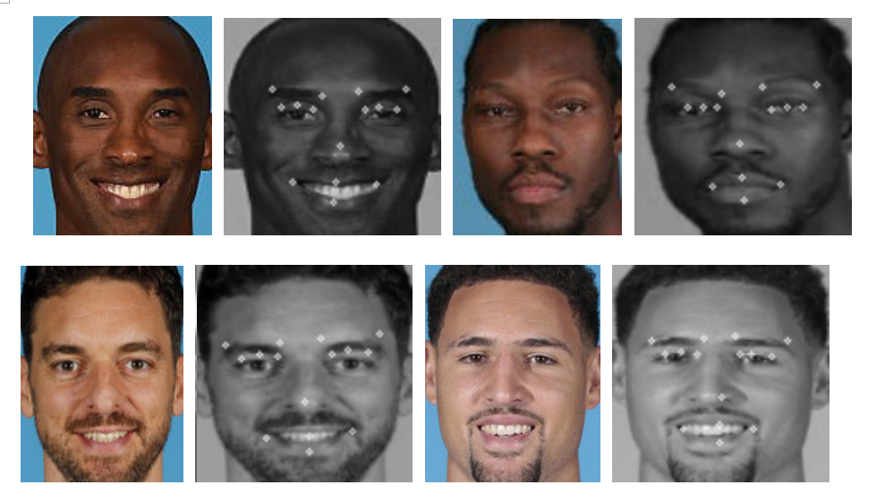

# Feature Point Detection With CNN
> This is an example of Face Feature Point Detection

## Prerequisities
The following dependencies are needed:
- numpy >= 1.11.1
- SimpleITK >=1.0.1
- opencv-python >=3.3.0
- tensorflow-gpu ==1.8.0
- pandas >=0.20.1
- scikit-learn >= 0.17.1

## How to Use

The data come from Kaggle face feature point, when you download the train and test csv file, run the `featurePointtrain.py` for training, run the `featurePointpredict.py` for predict.

The loss and model result

I also attach the trained model in the project, download trained model: https://pan.baidu.com/s/1UJHsKUzLVl-uOA61NcsPIQ passport: 4sei

There is some result image: one is the kaggle test data result, another is the nba star face detection result

## Contact
* https://github.com/junqiangchen
* email: 1207173174@qq.com
* WeChat Public number: 最新医学影像技术
